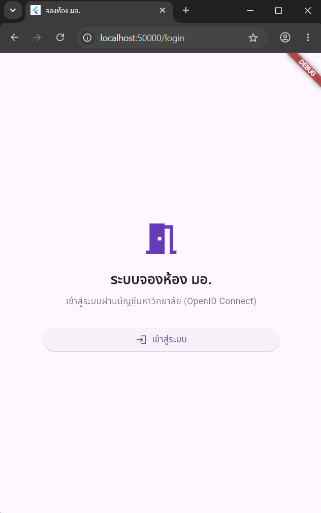
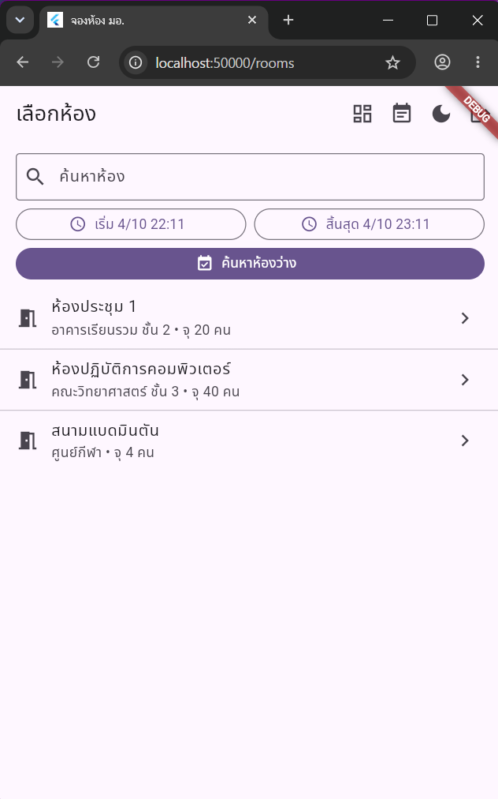

# ระบบจองห้อง (Room Booking)

แอปจองห้องและสถานที่ภายในมหาวิทยาลัย
แก้ปัญหาในการใช้สถานที่ร่วมกันของคนภายในมหาวิทยาลัย เพื่อค้นหาห้องตรวจสอบช่วงเวลาว่าง และจัดการรายการจองของตนเอง

## ฟีเจอร์

### ฟีเจอร์หลัก

- เข้าสู่ระบบและออกจากระบบด้วย OIDC
- ค้นหาและดูรายการห้อง พร้อมกรองห้องว่างตามวันและช่วงเวลา
- สร้าง อ่าน แก้ไข ยกเลิก และลบรายการจองของผู้ใช้
- ตรวจสอบเวลาเริ่ม/สิ้นสุด และป้องกันการจองห้องในช่วงเวลาที่ทับซ้อนกัน
- แสดงข้อผิดพลาดจาก API และให้โหลดข้อมูลใหม่ได้

### ฟีเจอร์เพิ่มเติม

- ค้นหาห้องตามชื่อ สถานที่ และรายละเอียด
- ดูรายการจองและกรองตามสถานะ ทั้งหมด ยืนยันแล้ว และยกเลิกแล้ว
- Dashboard สรุปจำนวนห้อง รายการจองที่กำลังจะมาถึง รายการที่ยกเลิก และการจองครั้งถัดไป
- สลับ Light/Dark Mode และจดจำค่าที่เลือกไว้ในเบราว์เซอร์
- ป้องกันหน้าภายในด้วย route guard และเก็บ credential ใน secure storage

## Tech Stack

- Flutter 3.47.0 (stable) / Dart 3.13.0 — Flutter Web, โครงสร้าง MVVM, Provider สำหรับ Dependency Injection และ GoRouter
- Dart SDK constraint: `^3.13.0` (กำหนดใน `frontend/pubspec.yaml`)
- Django 6.1, Django REST Framework 3.18.0, django-oidc-provider 0.9.0
- uv สำหรับจัดการ dependencies ของ Python (`backend/uv.lock`)
- SQLite สำหรับฐานข้อมูลการพัฒนาและสาธิตในเครื่อง

## สิ่งที่ต้องติดตั้งก่อนเริ่ม

- [Flutter SDK 3.47.0 stable](https://docs.flutter.dev/get-started/install) (มาพร้อม Dart 3.13.0)
- [Python 3.13 ขึ้นไป](https://www.python.org/downloads/)
- [uv](https://docs.astral.sh/uv/getting-started/installation/)
- [Google Chrome](https://www.google.com/chrome/) 

## วิธี Clone และรันระบบ

เปิด PowerShell หน้าต่างแรก แล้ว clone โปรเจกต์:

```powershell
git clone -b project https://github.com/sirikwan724/mobiledev69.git
cd mobiledev69
```

### Terminal 1 — Django API และ OIDC Provider

จากโฟลเดอร์หลักของโปรเจกต์ เปิด PowerShell หน้าต่างแรก แล้วรันคำสั่งตามลำดับ:

```powershell
cd backend
uv sync
$env:DJANGO_SECRET_KEY = (uv run python -c "from django.core.management.utils import get_random_secret_key; print(get_random_secret_key())")
uv run manage.py migrate
uv run manage.py seed_demo --reset-demo-password
uv run manage.py runserver 127.0.0.1:8000
```

### Terminal 2 — Flutter Web App

เปิด PowerShell อีกหน้าต่างหนึ่ง จากโฟลเดอร์หลักของโปรเจกต์:

```powershell
cd frontend
flutter pub get
flutter run -d chrome --web-port 50000
```

เมื่อแอปเปิดใน Chrome ให้กด **เข้าสู่ระบบ** แล้วใช้บัญชี Demo ที่สร้างจากคำสั่ง seed ด้านบน หากแสดงหน้า OIDC ขออนุญาต ให้กด **Authorize** ในการเข้าสู่ระบบครั้งแรก เมื่อสำเร็จแอปจะกลับไปหน้ารายการห้อง

### บัญชี Demo สำหรับเข้าสู่ระบบแอป

คำสั่ง `seed_demo` สร้างผู้ใช้ `student01` พร้อมรหัสผ่านแบบสุ่ม และแสดงรหัสผ่านครั้งเดียวใน Terminal ให้บันทึกไว้สำหรับการทดลองในเครื่อง หากลืมรหัสผ่าน ให้รัน `uv run manage.py seed_demo --reset-demo-password` เพื่อสร้างรหัสใหม่

บัญชีนี้มีไว้สำหรับการพัฒนาและสาธิตในเครื่องเท่านั้น ห้ามนำไปใช้กับระบบที่เปิดให้เข้าถึงจากอินเทอร์เน็ต

### ค่า OIDC ที่ seed ให้โดยอัตโนมัติ

คำสั่ง `seed_demo` ตั้งค่าผู้ใช้ตัวอย่างและ OIDC Client สำหรับการพัฒนาในเครื่อง หากตรวจใน Django Admin ที่ http://127.0.0.1:8000/admin/ ค่าหลักควรเป็น:

- Client ID: `flutter-web-app`
- Client type: `public`
- Response type: `code`
- Redirect URI: `http://localhost:50000/callback`
- Post Logout Redirect URI: `http://localhost:50000/login`
- Require consent: เปิด
- Reuse consent: เปิด

OIDC issuer ของแอปคือ `http://127.0.0.1:8000` หากเปลี่ยน port ของ Flutter ต้องปรับ redirect URI ให้ตรงกันใน Client และ `frontend/lib/core/auth/auth_service.dart`

## API หลัก

- `GET /api/rooms/` — รายการห้อง (ส่ง `start_time` และ `end_time` เพื่อกรองห้องว่างได้)
- `GET /api/bookings/` — รายการจองของผู้ใช้ที่ล็อกอิน
- `POST /api/bookings/` — สร้างรายการจอง
- `PUT /api/bookings/{id}/` — แก้ไขรายการจองของผู้ใช้
- `POST /api/bookings/{id}/cancel/` — ยกเลิกรายการจอง
- `DELETE /api/bookings/{id}/` — ลบรายการจองของผู้ใช้

## ภาพหน้าจอ

### หน้าเข้าสู่ระบบ



### หน้าค้นหาและเลือกรายการห้อง



## วิดีโอสาธิต

